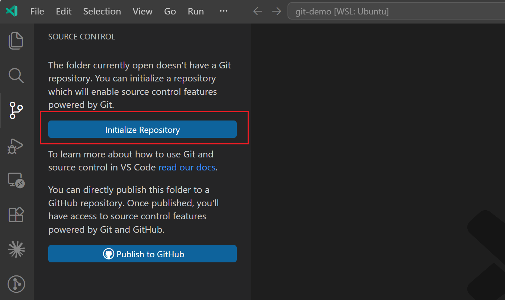
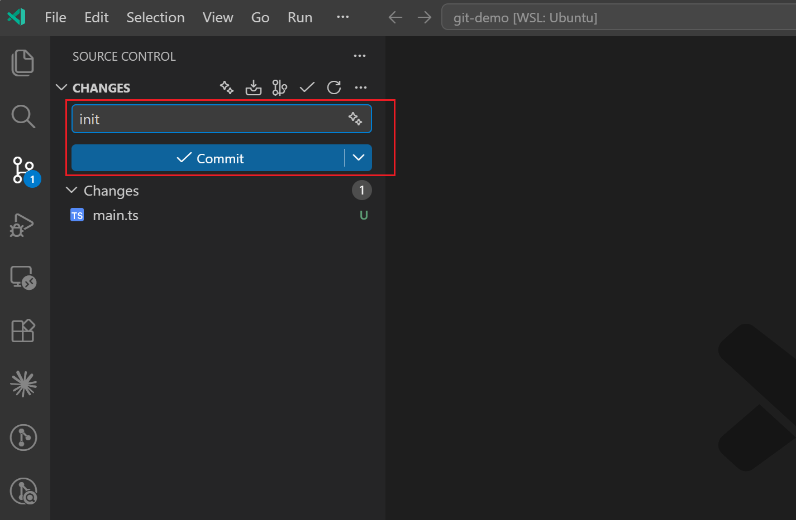

## 初始化项目仓库

**初始化仓库**

**提交文件记录**

### 修改提交记录

> 在上一次提交的基础上进行修改，而不创建一个新的提交记录。

**修改文件但是不影响提交记录**

## 提交文件到暂存区

**提交到暂存区**

**填写提交信息**

### 提交规范

**使用插件实现提交规范**

### 回退提交

**未提交，还原到上一次提交**

**已提交，回滚记录**

- `revert`：会创建一个新的提交记录
- `reset`：当提交没有推送到远程仓库时使用，不会创建新的提交记录
  - `mixed reset`：保留更改，但不会添加到缓存区
  - `soft reset`：还原到之前的提交状态，修改的操作记录会被保留下来并添加到缓存区
  - `soft hard reset`：将更改的内容全部删除，直接还原到之前的提交状态，中间任何操作记录都不会保留

