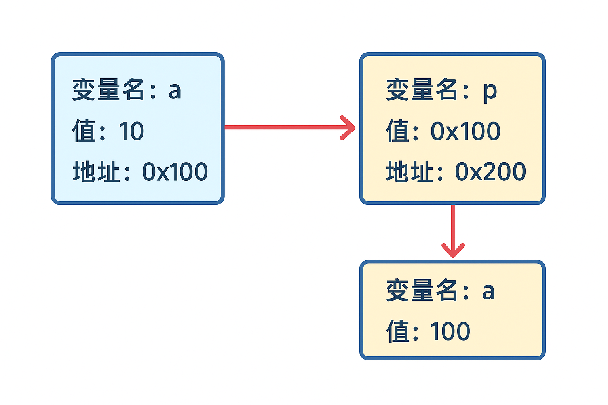
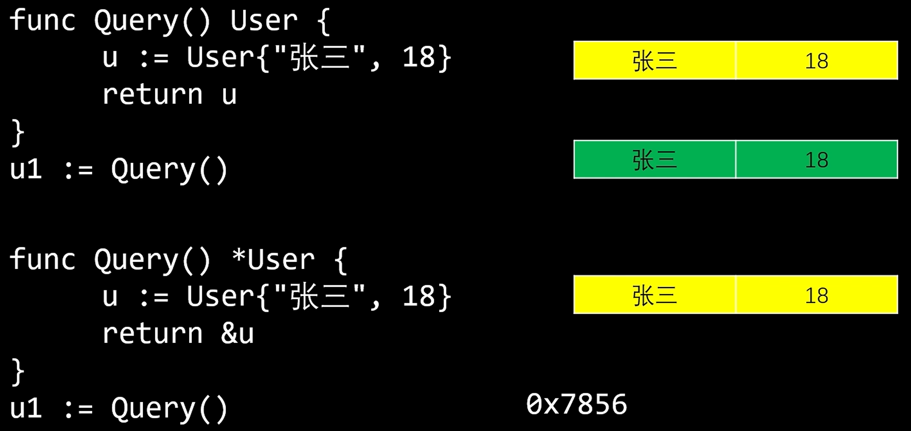

## 基础

```
*: 指针
&: 取地址
如果声明了一个指针，但是没有赋值，那么它是 nil
```

```go
var p *int  // 声明指针：声明一个指向 int 类型的指针，它可以存放一个 int 类型变量的内存地址。此时 p 的值为 nil，因为它没有指向任何东西
fmt.Println(p) // 输出: <nil>

a := 10
p = &a      // 取地址：将变量 a 的地址赋值给指针 p ，即 p 现在指向 a 。&a 表示取变量 a 的内存地址
fmt.Println(p)  // 输出类似：0xc000014098 (a 的内存地址)
fmt.Println(*p) // 输出: 10   (*p 表示取指针指向的值)

fmt.Println(a)  // 输出: 10
*p = 100    // 解引用：通过指针修改 a 的值为 100。*p 表示取出指针 p 指向的变量的值，即访问 a 的值
fmt.Println(a)  // 输出: 100
```

### 总结

| 概念   | 含义            | 结果    | 类比说明              |
|------|---------------|-------|-------------------|
| `a`  | 变量本身          | 100   | 你住的房子             |
| `&a` | 变量 a 的内存地址    | 0x100 | 房子的门牌号            |
| `p`  | 存储地址的变量（指针）   | 0x100 | 保存门牌号的小纸条         |
| `*p` | 取出指针指向的值（解引用） | 100   | 找到那栋房子（通过门牌号访问房子） |

### 图示



## 指针作为函数参数

- 值传递：函数内修改不影响原变量
- 指针传递：函数内修改影响原变量

```go
package main

import "fmt"

// 值传递
func zeroval(ival int) {
    ival = 0
}

// 指针传递
func zeroptr(iptr *int) {
    *iptr = 0
}

func main() {
    i := 1
    fmt.Println("initial:", i)  // initial: 1

    zeroval(i)
    fmt.Println("zeroval:", i)  // zeroval: 1

    // 通过 &i 语法来取得 i 的内存地址，即指向 i 的指针
    zeroptr(&i)
    fmt.Println("zeroptr:", i)  // zeroptr: 0

    fmt.Println("pointer:", &i)  // pointer: 0x42131100
}
```

## 指针参数


函数参数什么时候需要传指针？

- 需要修改原始的内存空间，就传指针

### 使用指针的案例

```go
var user User  # 声明空的结构体user
gormDB.Select("*").Where("id=1").First(&user)  # 修改原始的user结构体，给它赋值，所以传的是user的地址
```

_指针指向的是内存地址_

```go
func Handler(c *gin.Context) {
  c.Set("uid", 1)
}
```

```go
type MysqlErr struct {
	Code int
}

// *MysqlErr实现了Error方法
func (*MysqlErr) Error() string {
	return "err"
}

var err error = &MysqlErr {Code: 23}

if mysqlErr, ok := err.(*MysqlErr); ok {
    fmt.Println(mysqlErr.Code)
}
```

### 函数返回指针



