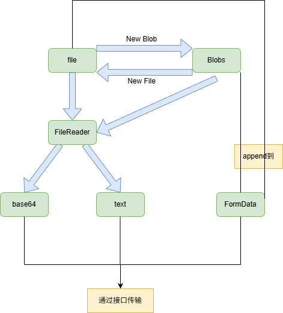

## 二进制 blob 传输

- 使用 formData 传输

### 单文件上传

```tsx
import { createFileRoute } from "@tanstack/react-router";
import {
  AlertCircle,
  CheckCircle2,
  ImageIcon,
  Trash2,
  UploadCloud,
} from "lucide-react";
import { useEffect, useMemo, useRef, useState } from "react";
import { Button } from "#/components/ui/button";

export const Route = createFileRoute("/upload/")({
  component: RouteComponent,
});

const acceptedImageTypes = [
  "image/jpeg",
  "image/png",
  "image/webp",
  "image/gif",
];
const acceptedImageText = "JPG、PNG、WEBP、GIF";
const maxFileSize = 5 * 1024 * 1024;

function formatFileSize(size: number) {
  if (size < 1024 * 1024) {
    return `${(size / 1024).toFixed(1)} KB`;
  }

  return `${(size / 1024 / 1024).toFixed(2)} MB`;
}

function RouteComponent() {
  const [file, setFile] = useState<File | null>(null);
  const [error, setError] = useState("");
  const [isDragging, setIsDragging] = useState(false);
  const inputRef = useRef<HTMLInputElement>(null);

  const previewUrl = useMemo(() => {
    if (!file) {
      return "";
    }

    return URL.createObjectURL(file);
  }, [file]);

  useEffect(() => {
    return () => {
      if (previewUrl) {
        URL.revokeObjectURL(previewUrl);
      }
    };
  }, [previewUrl]);

  const validateAndSetFile = (selectedFile?: File) => {
    setError("");

    if (!selectedFile) {
      setFile(null);
      return false;
    }

    if (!acceptedImageTypes.includes(selectedFile.type)) {
      setError(`请上传 ${acceptedImageText} 格式的图片`);
      setFile(null);
      return false;
    }

    if (selectedFile.size > maxFileSize) {
      setError("图片大小不能超过 5MB");
      setFile(null);
      return false;
    }

    setFile(selectedFile);
    return true;
  };

  const handleFileChange = (e: React.ChangeEvent<HTMLInputElement>) => {
    const isValid = validateAndSetFile(e.target.files?.[0]);

    if (!isValid) {
      e.target.value = "";
    }
  };

  const handleDrop = (e: React.DragEvent<HTMLLabelElement>) => {
    e.preventDefault();
    setIsDragging(false);
    validateAndSetFile(e.dataTransfer.files?.[0]);
  };

  const handleClear = () => {
    setFile(null);
    setError("");

    if (inputRef.current) {
      inputRef.current.value = "";
    }
  };

  const handleSubmit = async () => {
    if (!file) {
      setError("请先选择需要上传的图片");
      return;
    }

    const formData = new FormData();
    formData.append("image", file);

    try {
      console.log("准备上传的文件:", formData.get("image"));
      // 示例: const response = await fetch('/api/upload', { method: 'POST', body: formData });
      // if (response.ok) alert('上传成功');
    } catch (err) {
      console.error("上传失败", err);
      setError("上传失败，请重试");
    }
  };

  return (
    <main className="min-h-dvh bg-muted/30 px-4 py-8 sm:px-6 lg:px-8">
      <div className="mx-auto flex w-full max-w-3xl flex-col gap-5">
        <header className="flex flex-col gap-2">
          <p className="text-sm font-medium text-muted-foreground">图片上传</p>
          <div className="flex flex-col gap-3 sm:flex-row sm:items-end sm:justify-between">
            <div>
              <h1 className="text-2xl font-semibold tracking-normal text-foreground">
                上传素材图片
              </h1>
              <p className="mt-2 max-w-xl text-sm leading-6 text-muted-foreground">
                支持常见图片格式，单张图片最大
                5MB。选择文件后可先确认预览再上传。
              </p>
            </div>
            <div className="flex w-fit items-center gap-2 rounded-lg border bg-background px-3 py-2 text-xs text-muted-foreground">
              <CheckCircle2 className="size-4 text-emerald-600" />
              本地校验已启用
            </div>
          </div>
        </header>

        <section className="overflow-hidden rounded-xl border bg-background shadow-sm">
          <div className="grid gap-0 lg:grid-cols-[1fr_280px]">
            <div className="p-4 sm:p-6">
              <label
                className={[
                  "flex min-h-70 cursor-pointer flex-col items-center justify-center gap-4 rounded-lg border border-dashed px-5 py-8 text-center transition-colors",
                  isDragging
                    ? "border-primary bg-primary/5"
                    : "border-border bg-muted/30 hover:bg-muted/50",
                  error ? "border-destructive/70 bg-destructive/5" : "",
                ].join(" ")}
                onDragEnter={() => setIsDragging(true)}
                onDragLeave={() => setIsDragging(false)}
                onDragOver={(e) => e.preventDefault()}
                onDrop={handleDrop}
              >
                <input
                  ref={inputRef}
                  className="sr-only"
                  type="file"
                  name="image"
                  accept="image/png, image/jpeg, image/webp, image/gif"
                  onChange={handleFileChange}
                />

                <span className="flex size-14 items-center justify-center rounded-lg border bg-background">
                  <UploadCloud className="size-7 text-muted-foreground" />
                </span>
                <span className="space-y-1">
                  <span className="block text-base font-medium text-foreground">
                    拖拽图片到这里，或点击选择文件
                  </span>
                  <span className="block text-sm text-muted-foreground">
                    {acceptedImageText}，最大 5MB
                  </span>
                </span>
              </label>
            </div>

            <aside className="border-t bg-muted/20 p-4 sm:p-6 lg:border-l lg:border-t-0">
              <div className="flex h-full min-h-55 flex-col gap-4">
                <div className="flex items-center justify-between gap-3">
                  <h2 className="text-sm font-medium text-foreground">
                    文件详情
                  </h2>
                  {file ? (
                    <Button
                      aria-label="清除已选文件"
                      onClick={handleClear}
                      size="icon-sm"
                      type="button"
                      variant="ghost"
                    >
                      <Trash2 className="size-4" />
                    </Button>
                  ) : null}
                </div>

                <div className="flex flex-1 flex-col gap-4">
                  <div className="flex aspect-4/3 items-center justify-center overflow-hidden rounded-lg border bg-background">
                    {previewUrl ? (
                      
                    ) : (
                      <div className="flex flex-col items-center gap-2 text-muted-foreground">
                        <ImageIcon className="size-8" />
                        <span className="text-sm">等待选择图片</span>
                      </div>
                    )}
                  </div>

                  {file ? (
                    <dl className="grid gap-3 text-sm">
                      <div>
                        <dt className="text-muted-foreground">文件名</dt>
                        <dd className="mt-1 break-all font-medium text-foreground">
                          {file.name}
                        </dd>
                      </div>
                      <div className="grid grid-cols-2 gap-3">
                        <div>
                          <dt className="text-muted-foreground">大小</dt>
                          <dd className="mt-1 font-medium text-foreground">
                            {formatFileSize(file.size)}
                          </dd>
                        </div>
                        <div>
                          <dt className="text-muted-foreground">类型</dt>
                          <dd className="mt-1 font-medium text-foreground">
                            {file.type.replace("image/", "").toUpperCase()}
                          </dd>
                        </div>
                      </div>
                    </dl>
                  ) : (
                    <p className="text-sm leading-6 text-muted-foreground">
                      选择图片后，这里会显示预览、文件名、大小和格式。
                    </p>
                  )}
                </div>
              </div>
            </aside>
          </div>

          <div className="flex flex-col gap-3 border-t bg-background px-4 py-4 sm:flex-row sm:items-center sm:justify-between sm:px-6">
            <div className="min-h-5">
              {error ? (
                <p className="flex items-center gap-2 text-sm text-destructive">
                  <AlertCircle className="size-4" />
                  {error}
                </p>
              ) : file ? (
                <p className="flex items-center gap-2 text-sm text-emerald-700">
                  <CheckCircle2 className="size-4" />
                  文件已就绪，可以上传
                </p>
              ) : (
                <p className="text-sm text-muted-foreground">
                  请先选择一张需要上传的图片。
                </p>
              )}
            </div>

            <div className="flex gap-2">
              <Button
                disabled={!file}
                onClick={handleSubmit}
                type="button"
                className="w-full sm:w-auto"
              >
                <UploadCloud className="size-4" />
                上传图片
              </Button>
            </div>
          </div>
        </section>
      </div>
    </main>
  );
}
```

### 多文件上传

```tsx
import { createFileRoute } from "@tanstack/react-router";
import {
  AlertCircle,
  CheckCircle2,
  ImageIcon,
  Trash2,
  UploadCloud,
  X,
} from "lucide-react";
import { useEffect, useRef, useState } from "react";
import { Button } from "#/components/ui/button";

export const Route = createFileRoute("/upload/")({
  component: RouteComponent,
});

const acceptedImageTypes = [
  "image/jpeg",
  "image/png",
  "image/webp",
  "image/gif",
];
const acceptedImageText = "JPG、PNG、WEBP、GIF";
const maxFileSize = 5 * 1024 * 1024;
const maxFileCount = 9;

type UploadItem = {
  id: string;
  file: File;
  previewUrl: string;
};

function formatFileSize(size: number) {
  if (size < 1024 * 1024) {
    return `${(size / 1024).toFixed(1)} KB`;
  }

  return `${(size / 1024 / 1024).toFixed(2)} MB`;
}

function createId() {
  if (typeof crypto !== "undefined" && "randomUUID" in crypto) {
    return crypto.randomUUID();
  }

  return `${Date.now()}-${Math.random().toString(36).slice(2)}`;
}

function RouteComponent() {
  const [items, setItems] = useState<UploadItem[]>([]);
  const [error, setError] = useState("");
  const [isDragging, setIsDragging] = useState(false);
  const inputRef = useRef<HTMLInputElement>(null);
  const itemsRef = useRef(items);

  itemsRef.current = items;

  useEffect(() => {
    return () => {
      for (const item of itemsRef.current) {
        URL.revokeObjectURL(item.previewUrl);
      }
    };
  }, []);

  const addFiles = (incoming: FileList | File[] | null | undefined) => {
    if (!incoming || incoming.length === 0) {
      return;
    }

    const incomingList = Array.from(incoming);
    const errors: string[] = [];
    const accepted: UploadItem[] = [];

    setItems((prev) => {
      const seen = new Set(
        prev.map((item) => `${item.file.name}_${item.file.size}`),
      );
      let remaining = maxFileCount - prev.length;

      for (const file of incomingList) {
        if (remaining <= 0) {
          errors.push(`最多只能上传 ${maxFileCount} 张图片`);
          break;
        }

        if (!acceptedImageTypes.includes(file.type)) {
          errors.push(`${file.name}：格式不支持`);
          continue;
        }

        if (file.size > maxFileSize) {
          errors.push(`${file.name}：超过 5MB`);
          continue;
        }

        const key = `${file.name}_${file.size}`;
        if (seen.has(key)) {
          continue;
        }

        seen.add(key);
        accepted.push({
          id: createId(),
          file,
          previewUrl: URL.createObjectURL(file),
        });
        remaining -= 1;
      }

      setError(errors.length > 0 ? Array.from(new Set(errors)).join("；") : "");
      return [...prev, ...accepted];
    });
  };

  const handleFileChange = (e: React.ChangeEvent<HTMLInputElement>) => {
    addFiles(e.target.files);
    e.target.value = "";
  };

  const handleDrop = (e: React.DragEvent<HTMLLabelElement>) => {
    e.preventDefault();
    setIsDragging(false);
    addFiles(e.dataTransfer.files);
  };

  const removeItem = (id: string) => {
    setItems((prev) => {
      const target = prev.find((item) => item.id === id);
      if (target) {
        URL.revokeObjectURL(target.previewUrl);
      }
      return prev.filter((item) => item.id !== id);
    });
    setError("");
  };

  const handleClearAll = () => {
    for (const item of items) {
      URL.revokeObjectURL(item.previewUrl);
    }
    setItems([]);
    setError("");

    if (inputRef.current) {
      inputRef.current.value = "";
    }
  };

  const handleSubmit = async () => {
    if (items.length === 0) {
      setError("请先选择需要上传的图片");
      return;
    }

    const formData = new FormData();
    for (const item of items) {
      formData.append("images", item.file, item.file.name);
    }

    try {
      console.log("准备上传的文件:", formData.getAll("images"));
      // 示例: const response = await fetch('/api/upload', { method: 'POST', body: formData });
      // if (response.ok) alert('上传成功');
    } catch (err) {
      console.error("上传失败", err);
      setError("上传失败，请重试");
    }
  };

  const totalSize = items.reduce((sum, item) => sum + item.file.size, 0);
  const hasItems = items.length > 0;

  return (
    <main className="min-h-dvh bg-muted/30 px-4 py-8 sm:px-6 lg:px-8">
      <div className="mx-auto flex w-full max-w-3xl flex-col gap-5">
        <header className="flex flex-col gap-2">
          <p className="text-sm font-medium text-muted-foreground">图片上传</p>
          <div className="flex flex-col gap-3 sm:flex-row sm:items-end sm:justify-between">
            <div>
              <h1 className="text-2xl font-semibold tracking-normal text-foreground">
                上传素材图片
              </h1>
              <p className="mt-2 max-w-xl text-sm leading-6 text-muted-foreground">
                支持常见图片格式，单张图片最大 5MB，一次最多上传 {maxFileCount}{" "}
                张，可在列表中单独删除。
              </p>
            </div>
            <div className="flex w-fit items-center gap-2 rounded-lg border bg-background px-3 py-2 text-xs text-muted-foreground">
              <CheckCircle2 className="size-4 text-emerald-600" />
              本地校验已启用
            </div>
          </div>
        </header>

        <section className="overflow-hidden rounded-xl border bg-background shadow-sm">
          <div className="grid gap-0 lg:grid-cols-[1fr_320px]">
            <div className="p-4 sm:p-6">
              <label
                className={[
                  "flex min-h-70 cursor-pointer flex-col items-center justify-center gap-4 rounded-lg border border-dashed px-5 py-8 text-center transition-colors",
                  isDragging
                    ? "border-primary bg-primary/5"
                    : "border-border bg-muted/30 hover:bg-muted/50",
                  error ? "border-destructive/70 bg-destructive/5" : "",
                ].join(" ")}
                onDragEnter={() => setIsDragging(true)}
                onDragLeave={() => setIsDragging(false)}
                onDragOver={(e) => e.preventDefault()}
                onDrop={handleDrop}
              >
                <input
                  ref={inputRef}
                  className="sr-only"
                  type="file"
                  name="images"
                  multiple
                  accept="image/png, image/jpeg, image/webp, image/gif"
                  onChange={handleFileChange}
                />

                <span className="flex size-14 items-center justify-center rounded-lg border bg-background">
                  <UploadCloud className="size-7 text-muted-foreground" />
                </span>
                <span className="space-y-1">
                  <span className="block text-base font-medium text-foreground">
                    拖拽图片到这里，或点击选择文件
                  </span>
                  <span className="block text-sm text-muted-foreground">
                    支持多选，{acceptedImageText}，单张最大 5MB
                  </span>
                </span>
              </label>
            </div>

            <aside className="border-t bg-muted/20 p-4 sm:p-6 lg:border-l lg:border-t-0">
              <div className="flex h-full min-h-55 flex-col gap-4">
                <div className="flex items-center justify-between gap-3">
                  <h2 className="text-sm font-medium text-foreground">
                    已选文件
                    {hasItems ? (
                      <span className="ml-2 text-xs font-normal text-muted-foreground">
                        {items.length} / {maxFileCount} ·{" "}
                        {formatFileSize(totalSize)}
                      </span>
                    ) : null}
                  </h2>
                  {hasItems ? (
                    <Button
                      aria-label="清除全部文件"
                      onClick={handleClearAll}
                      size="icon-sm"
                      type="button"
                      variant="ghost"
                    >
                      <Trash2 className="size-4" />
                    </Button>
                  ) : null}
                </div>

                {hasItems ? (
                  <ul className="flex max-h-96 flex-1 flex-col gap-2 overflow-y-auto pr-1">
                    {items.map((item) => (
                      <li
                        key={item.id}
                        className="group flex items-center gap-3 rounded-lg border bg-background p-2"
                      >
                        <div className="size-12 shrink-0 overflow-hidden rounded-md border bg-muted">
                          
                        </div>
                        <div className="min-w-0 flex-1">
                          <p className="truncate text-sm font-medium text-foreground">
                            {item.file.name}
                          </p>
                          <p className="mt-0.5 text-xs text-muted-foreground">
                            {formatFileSize(item.file.size)} ·{" "}
                            {item.file.type.replace("image/", "").toUpperCase()}
                          </p>
                        </div>
                        <Button
                          aria-label={`移除 ${item.file.name}`}
                          onClick={() => removeItem(item.id)}
                          size="icon-sm"
                          type="button"
                          variant="ghost"
                        >
                          <X className="size-4" />
                        </Button>
                      </li>
                    ))}
                  </ul>
                ) : (
                  <div className="flex flex-1 flex-col items-center justify-center gap-2 rounded-lg border border-dashed bg-background/50 py-10 text-muted-foreground">
                    <ImageIcon className="size-8" />
                    <span className="text-sm">等待选择图片</span>
                  </div>
                )}
              </div>
            </aside>
          </div>

          <div className="flex flex-col gap-3 border-t bg-background px-4 py-4 sm:flex-row sm:items-center sm:justify-between sm:px-6">
            <div className="min-h-5">
              {error ? (
                <p className="flex items-center gap-2 text-sm text-destructive">
                  <AlertCircle className="size-4" />
                  {error}
                </p>
              ) : hasItems ? (
                <p className="flex items-center gap-2 text-sm text-emerald-700">
                  <CheckCircle2 className="size-4" />
                  {items.length} 个文件已就绪，可以上传
                </p>
              ) : (
                <p className="text-sm text-muted-foreground">
                  请先选择需要上传的图片，支持一次选择多张。
                </p>
              )}
            </div>

            <div className="flex gap-2">
              <Button
                disabled={!hasItems}
                onClick={handleSubmit}
                type="button"
                className="w-full sm:w-auto"
              >
                <UploadCloud className="size-4" />
                上传 {hasItems ? `${items.length} 张` : "图片"}
              </Button>
            </div>
          </div>
        </section>
      </div>
    </main>
  );
}
```

### 分片上传

```tsx
import { createFileRoute } from "@tanstack/react-router";
import {
  AlertCircle,
  CheckCircle2,
  File as FileIcon,
  ImageIcon,
  Pause,
  Play,
  Trash2,
  UploadCloud,
  X,
} from "lucide-react";
import { useEffect, useMemo, useRef, useState } from "react";
import { Button } from "#/components/ui/button";

export const Route = createFileRoute("/upload/")({
  component: RouteComponent,
});

const maxFileSize = 10 * 1024 * 1024 * 1024;
const chunkSize = 5 * 1024 * 1024;
const maxConcurrency = 3;

type UploadState = "idle" | "uploading" | "paused" | "completed" | "error";

type Chunk = {
  index: number;
  start: number;
  end: number;
  uploaded: boolean;
  uploading: boolean;
};

function formatFileSize(size: number) {
  if (size < 1024) {
    return `${size} B`;
  }
  if (size < 1024 * 1024) {
    return `${(size / 1024).toFixed(1)} KB`;
  }
  if (size < 1024 * 1024 * 1024) {
    return `${(size / 1024 / 1024).toFixed(2)} MB`;
  }
  return `${(size / 1024 / 1024 / 1024).toFixed(2)} GB`;
}

async function uploadChunkRequest(
  _blob: Blob,
  _meta: { index: number; total: number; fileName: string },
  signal: AbortSignal,
) {
  // 真实实现示例：
  // const formData = new FormData();
  // formData.append("chunk", _blob);
  // formData.append("index", String(_meta.index));
  // formData.append("total", String(_meta.total));
  // formData.append("fileName", _meta.fileName);
  // await fetch("/api/upload/chunk", { method: "POST", body: formData, signal });

  return new Promise<void>((resolve, reject) => {
    if (signal.aborted) {
      reject(new DOMException("Aborted", "AbortError"));
      return;
    }
    const onAbort = () => {
      clearTimeout(timer);
      signal.removeEventListener("abort", onAbort);
      reject(new DOMException("Aborted", "AbortError"));
    };
    const timer = setTimeout(
      () => {
        signal.removeEventListener("abort", onAbort);
        resolve();
      },
      300 + Math.random() * 400,
    );
    signal.addEventListener("abort", onAbort);
  });
}

function RouteComponent() {
  const [file, setFile] = useState<File | null>(null);
  const [error, setError] = useState("");
  const [isDragging, setIsDragging] = useState(false);
  const [uploadState, setUploadState] = useState<UploadState>("idle");
  const [uploadedBytes, setUploadedBytes] = useState(0);
  const inputRef = useRef<HTMLInputElement>(null);
  const chunksRef = useRef<Chunk[]>([]);
  const abortRef = useRef<AbortController | null>(null);
  const pauseRef = useRef(false);

  const isImage = file?.type.startsWith("image/") ?? false;

  const previewUrl = useMemo(() => {
    if (!file || !isImage) {
      return "";
    }
    return URL.createObjectURL(file);
  }, [file, isImage]);

  useEffect(() => {
    return () => {
      if (previewUrl) {
        URL.revokeObjectURL(previewUrl);
      }
    };
  }, [previewUrl]);

  useEffect(() => {
    return () => {
      abortRef.current?.abort();
    };
  }, []);

  const totalChunks = chunksRef.current.length;
  const uploadedChunkCount = chunksRef.current.filter((c) => c.uploaded).length;
  const progress =
    file && file.size > 0
      ? Math.min(100, (uploadedBytes / file.size) * 100)
      : 0;

  const resetUploadState = () => {
    chunksRef.current = [];
    abortRef.current = null;
    pauseRef.current = false;
    setUploadedBytes(0);
    setUploadState("idle");
  };

  const validateAndSetFile = (selectedFile?: File) => {
    setError("");

    if (!selectedFile) {
      setFile(null);
      resetUploadState();
      return false;
    }

    if (selectedFile.size > maxFileSize) {
      setError(`文件大小不能超过 ${formatFileSize(maxFileSize)}`);
      setFile(null);
      resetUploadState();
      return false;
    }

    setFile(selectedFile);
    resetUploadState();
    return true;
  };

  const handleFileChange = (e: React.ChangeEvent<HTMLInputElement>) => {
    const isValid = validateAndSetFile(e.target.files?.[0]);

    if (!isValid) {
      e.target.value = "";
    }
  };

  const handleDrop = (e: React.DragEvent<HTMLLabelElement>) => {
    e.preventDefault();
    setIsDragging(false);
    validateAndSetFile(e.dataTransfer.files?.[0]);
  };

  const handleClear = () => {
    abortRef.current?.abort();
    setFile(null);
    setError("");
    resetUploadState();

    if (inputRef.current) {
      inputRef.current.value = "";
    }
  };

  const startUpload = async () => {
    if (!file) {
      setError("请先选择需要上传的文件");
      return;
    }

    if (chunksRef.current.length === 0) {
      const chunks: Chunk[] = [];
      let index = 0;
      for (let start = 0; start < file.size; start += chunkSize) {
        chunks.push({
          index,
          start,
          end: Math.min(start + chunkSize, file.size),
          uploaded: false,
          uploading: false,
        });
        index++;
      }
      chunksRef.current = chunks;
      setUploadedBytes(0);
    }

    pauseRef.current = false;
    const controller = new AbortController();
    abortRef.current = controller;
    setUploadState("uploading");
    setError("");

    const total = chunksRef.current.length;

    const worker = async () => {
      while (!pauseRef.current && !controller.signal.aborted) {
        const target = chunksRef.current.find(
          (c) => !c.uploaded && !c.uploading,
        );
        if (!target) {
          return;
        }
        target.uploading = true;

        try {
          await uploadChunkRequest(
            file.slice(target.start, target.end),
            { index: target.index, total, fileName: file.name },
            controller.signal,
          );
          target.uploaded = true;
          target.uploading = false;
          setUploadedBytes((prev) => prev + (target.end - target.start));
        } catch (err) {
          target.uploading = false;
          if ((err as Error).name === "AbortError") {
            return;
          }
          throw err;
        }
      }
    };

    try {
      const workers = Array.from(
        { length: Math.min(maxConcurrency, total) },
        worker,
      );
      await Promise.all(workers);

      if (controller.signal.aborted) {
        return;
      }

      if (chunksRef.current.every((c) => c.uploaded)) {
        setUploadState("completed");
        console.log("所有分片上传完成，文件:", file.name);
        // 真实实现：通知后端合并分片
        // await fetch("/api/upload/complete", { method: "POST", body: ... });
      }
    } catch (err) {
      console.error("上传失败", err);
      setUploadState("error");
      setError("上传失败，请重试");
    }
  };

  const pauseUpload = () => {
    pauseRef.current = true;
    abortRef.current?.abort();
    setUploadState("paused");
  };

  const cancelUpload = () => {
    abortRef.current?.abort();
    pauseRef.current = false;
    chunksRef.current = [];
    setUploadedBytes(0);
    setUploadState("idle");
  };

  const isUploading = uploadState === "uploading";
  const isPaused = uploadState === "paused";
  const isCompleted = uploadState === "completed";
  const isErrored = uploadState === "error";
  const hasProgress = totalChunks > 0;

  return (
    <main className="min-h-dvh bg-muted/30 px-4 py-8 sm:px-6 lg:px-8">
      <div className="mx-auto flex w-full max-w-3xl flex-col gap-5">
        <header className="flex flex-col gap-2">
          <p className="text-sm font-medium text-muted-foreground">文件上传</p>
          <div className="flex flex-col gap-3 sm:flex-row sm:items-end sm:justify-between">
            <div>
              <h1 className="text-2xl font-semibold tracking-normal text-foreground">
                大文件分片上传
              </h1>
              <p className="mt-2 max-w-xl text-sm leading-6 text-muted-foreground">
                支持任意类型文件，单文件最大 {formatFileSize(maxFileSize)}
                ，按 {formatFileSize(chunkSize)} 切片上传，{maxConcurrency}{" "}
                并发，可暂停/继续/取消。
              </p>
            </div>
            <div className="flex w-fit items-center gap-2 rounded-lg border bg-background px-3 py-2 text-xs text-muted-foreground">
              <CheckCircle2 className="size-4 text-emerald-600" />
              本地校验已启用
            </div>
          </div>
        </header>

        <section className="overflow-hidden rounded-xl border bg-background shadow-sm">
          <div className="grid gap-0 lg:grid-cols-[1fr_280px]">
            <div className="p-4 sm:p-6">
              <label
                className={[
                  "flex min-h-70 cursor-pointer flex-col items-center justify-center gap-4 rounded-lg border border-dashed px-5 py-8 text-center transition-colors",
                  isDragging
                    ? "border-primary bg-primary/5"
                    : "border-border bg-muted/30 hover:bg-muted/50",
                  error ? "border-destructive/70 bg-destructive/5" : "",
                  isUploading ? "pointer-events-none opacity-60" : "",
                ].join(" ")}
                onDragEnter={() => setIsDragging(true)}
                onDragLeave={() => setIsDragging(false)}
                onDragOver={(e) => e.preventDefault()}
                onDrop={handleDrop}
              >
                <input
                  ref={inputRef}
                  className="sr-only"
                  type="file"
                  name="file"
                  disabled={isUploading}
                  onChange={handleFileChange}
                />

                <span className="flex size-14 items-center justify-center rounded-lg border bg-background">
                  <UploadCloud className="size-7 text-muted-foreground" />
                </span>
                <span className="space-y-1">
                  <span className="block text-base font-medium text-foreground">
                    拖拽文件到这里，或点击选择文件
                  </span>
                  <span className="block text-sm text-muted-foreground">
                    单文件最大 {formatFileSize(maxFileSize)}
                  </span>
                </span>
              </label>

              {file && hasProgress ? (
                <div className="mt-4 space-y-2">
                  <div className="flex items-center justify-between text-xs text-muted-foreground">
                    <span>
                      {uploadedChunkCount} / {totalChunks} 分片 ·{" "}
                      {formatFileSize(uploadedBytes)} /{" "}
                      {formatFileSize(file.size)}
                    </span>
                    <span className="font-medium text-foreground">
                      {progress.toFixed(1)}%
                    </span>
                  </div>
                  <div className="h-2 overflow-hidden rounded-full bg-muted">
                    <div
                      className={[
                        "h-full transition-all",
                        isErrored
                          ? "bg-destructive"
                          : isCompleted
                            ? "bg-emerald-500"
                            : "bg-primary",
                      ].join(" ")}
                      style={{ width: `${progress}%` }}
                    />
                  </div>
                </div>
              ) : null}
            </div>

            <aside className="border-t bg-muted/20 p-4 sm:p-6 lg:border-l lg:border-t-0">
              <div className="flex h-full min-h-55 flex-col gap-4">
                <div className="flex items-center justify-between gap-3">
                  <h2 className="text-sm font-medium text-foreground">
                    文件详情
                  </h2>
                  {file ? (
                    <Button
                      aria-label="清除已选文件"
                      onClick={handleClear}
                      size="icon-sm"
                      type="button"
                      variant="ghost"
                    >
                      <Trash2 className="size-4" />
                    </Button>
                  ) : null}
                </div>

                <div className="flex flex-1 flex-col gap-4">
                  <div className="flex aspect-4/3 items-center justify-center overflow-hidden rounded-lg border bg-background">
                    {previewUrl ? (
                      
                    ) : file ? (
                      <div className="flex flex-col items-center gap-2 text-muted-foreground">
                        <FileIcon className="size-8" />
                        <span className="px-4 text-center text-xs break-all">
                          {file.name}
                        </span>
                      </div>
                    ) : (
                      <div className="flex flex-col items-center gap-2 text-muted-foreground">
                        <ImageIcon className="size-8" />
                        <span className="text-sm">等待选择文件</span>
                      </div>
                    )}
                  </div>

                  {file ? (
                    <dl className="grid gap-3 text-sm">
                      <div>
                        <dt className="text-muted-foreground">文件名</dt>
                        <dd className="mt-1 break-all font-medium text-foreground">
                          {file.name}
                        </dd>
                      </div>
                      <div className="grid grid-cols-2 gap-3">
                        <div>
                          <dt className="text-muted-foreground">大小</dt>
                          <dd className="mt-1 font-medium text-foreground">
                            {formatFileSize(file.size)}
                          </dd>
                        </div>
                        <div>
                          <dt className="text-muted-foreground">类型</dt>
                          <dd className="mt-1 truncate font-medium text-foreground">
                            {file.type || "未知"}
                          </dd>
                        </div>
                      </div>
                    </dl>
                  ) : (
                    <p className="text-sm leading-6 text-muted-foreground">
                      选择文件后，这里会显示预览、文件名、大小和格式。
                    </p>
                  )}
                </div>
              </div>
            </aside>
          </div>

          <div className="flex flex-col gap-3 border-t bg-background px-4 py-4 sm:flex-row sm:items-center sm:justify-between sm:px-6">
            <div className="min-h-5">
              {error ? (
                <p className="flex items-center gap-2 text-sm text-destructive">
                  <AlertCircle className="size-4" />
                  {error}
                </p>
              ) : isCompleted ? (
                <p className="flex items-center gap-2 text-sm text-emerald-700">
                  <CheckCircle2 className="size-4" />
                  上传完成
                </p>
              ) : isUploading ? (
                <p className="flex items-center gap-2 text-sm text-primary">
                  <UploadCloud className="size-4" />
                  上传中…{progress.toFixed(1)}%
                </p>
              ) : isPaused ? (
                <p className="flex items-center gap-2 text-sm text-amber-600">
                  <Pause className="size-4" />
                  已暂停，可继续上传
                </p>
              ) : file ? (
                <p className="flex items-center gap-2 text-sm text-emerald-700">
                  <CheckCircle2 className="size-4" />
                  文件已就绪，可以上传
                </p>
              ) : (
                <p className="text-sm text-muted-foreground">
                  请先选择需要上传的文件。
                </p>
              )}
            </div>

            <div className="flex flex-wrap gap-2">
              {isUploading ? (
                <Button
                  onClick={pauseUpload}
                  type="button"
                  variant="outline"
                  className="w-full sm:w-auto"
                >
                  <Pause className="size-4" />
                  暂停
                </Button>
              ) : null}

              {(isPaused || isErrored) && hasProgress ? (
                <Button
                  onClick={cancelUpload}
                  type="button"
                  variant="outline"
                  className="w-full sm:w-auto"
                >
                  <X className="size-4" />
                  取消
                </Button>
              ) : null}

              {isUploading ? null : (
                <Button
                  disabled={!file || isCompleted}
                  onClick={() => void startUpload()}
                  type="button"
                  className="w-full sm:w-auto"
                >
                  {isPaused ? (
                    <>
                      <Play className="size-4" />
                      继续上传
                    </>
                  ) : isErrored ? (
                    <>
                      <UploadCloud className="size-4" />
                      重试
                    </>
                  ) : isCompleted ? (
                    <>
                      <CheckCircle2 className="size-4" />
                      已完成
                    </>
                  ) : (
                    <>
                      <UploadCloud className="size-4" />
                      开始上传
                    </>
                  )}
                </Button>
              )}
            </div>
          </div>
        </section>
      </div>
    </main>
  );
}
```

### 断点续传

```tsx
import { createFileRoute } from "@tanstack/react-router";
import {
  AlertCircle,
  CheckCircle2,
  File as FileIcon,
  ImageIcon,
  Loader2,
  Pause,
  Play,
  RotateCcw,
  Trash2,
  UploadCloud,
  X,
} from "lucide-react";
import { useEffect, useMemo, useRef, useState } from "react";
import { Button } from "#/components/ui/button";

export const Route = createFileRoute("/upload/")({
  component: RouteComponent,
});

const maxFileSize = 10 * 1024 * 1024 * 1024;
const chunkSize = 5 * 1024 * 1024;
const maxConcurrency = 3;
const storagePrefix = "upload:resume:";

type UploadState =
  | "idle"
  | "preparing"
  | "uploading"
  | "paused"
  | "completed"
  | "error";

type Chunk = {
  index: number;
  start: number;
  end: number;
  uploaded: boolean;
  uploading: boolean;
};

type StoredProgress = {
  fileName: string;
  fileSize: number;
  totalChunks: number;
  uploadedIndices: number[];
  updatedAt: number;
};

function formatFileSize(size: number) {
  if (size < 1024) {
    return `${size} B`;
  }
  if (size < 1024 * 1024) {
    return `${(size / 1024).toFixed(1)} KB`;
  }
  if (size < 1024 * 1024 * 1024) {
    return `${(size / 1024 / 1024).toFixed(2)} MB`;
  }
  return `${(size / 1024 / 1024 / 1024).toFixed(2)} GB`;
}

function buildChunks(file: File): Chunk[] {
  const chunks: Chunk[] = [];
  let index = 0;
  for (let start = 0; start < file.size; start += chunkSize) {
    chunks.push({
      index,
      start,
      end: Math.min(start + chunkSize, file.size),
      uploaded: false,
      uploading: false,
    });
    index++;
  }
  return chunks;
}

async function computeFingerprint(file: File): Promise<string> {
  const sampleSize = Math.min(chunkSize, file.size);
  const head = await file.slice(0, sampleSize).arrayBuffer();
  const tail =
    file.size > sampleSize
      ? await file.slice(file.size - sampleSize).arrayBuffer()
      : new ArrayBuffer(0);
  const meta = new TextEncoder().encode(
    `${file.name}|${file.size}|${file.lastModified}`,
  );
  const combined = new Uint8Array(
    meta.byteLength + head.byteLength + tail.byteLength,
  );
  combined.set(meta, 0);
  combined.set(new Uint8Array(head), meta.byteLength);
  combined.set(new Uint8Array(tail), meta.byteLength + head.byteLength);
  const hash = await crypto.subtle.digest("SHA-256", combined);
  return Array.from(new Uint8Array(hash))
    .map((b) => b.toString(16).padStart(2, "0"))
    .join("")
    .slice(0, 32);
}

function loadProgress(fingerprint: string): StoredProgress | null {
  try {
    const raw = localStorage.getItem(storagePrefix + fingerprint);
    if (!raw) {
      return null;
    }
    const parsed = JSON.parse(raw) as StoredProgress;
    if (
      !parsed ||
      typeof parsed.fileSize !== "number" ||
      !Array.isArray(parsed.uploadedIndices)
    ) {
      return null;
    }
    return parsed;
  } catch {
    return null;
  }
}

function saveProgress(fingerprint: string, progress: StoredProgress) {
  try {
    localStorage.setItem(storagePrefix + fingerprint, JSON.stringify(progress));
  } catch (err) {
    console.warn("持久化上传进度失败", err);
  }
}

function clearProgress(fingerprint: string) {
  try {
    localStorage.removeItem(storagePrefix + fingerprint);
  } catch {
    /* noop */
  }
}

async function uploadChunkRequest(
  _blob: Blob,
  _meta: {
    index: number;
    total: number;
    fingerprint: string;
    fileName: string;
  },
  signal: AbortSignal,
) {
  // 真实实现：
  // const formData = new FormData();
  // formData.append("chunk", _blob);
  // formData.append("index", String(_meta.index));
  // formData.append("total", String(_meta.total));
  // formData.append("fingerprint", _meta.fingerprint);
  // formData.append("fileName", _meta.fileName);
  // await fetch("/api/upload/chunk", { method: "POST", body: formData, signal });

  return new Promise<void>((resolve, reject) => {
    if (signal.aborted) {
      reject(new DOMException("Aborted", "AbortError"));
      return;
    }
    const onAbort = () => {
      clearTimeout(timer);
      signal.removeEventListener("abort", onAbort);
      reject(new DOMException("Aborted", "AbortError"));
    };
    const timer = setTimeout(
      () => {
        signal.removeEventListener("abort", onAbort);
        resolve();
      },
      300 + Math.random() * 400,
    );
    signal.addEventListener("abort", onAbort);
  });
}

function RouteComponent() {
  const [file, setFile] = useState<File | null>(null);
  const [error, setError] = useState("");
  const [isDragging, setIsDragging] = useState(false);
  const [uploadState, setUploadState] = useState<UploadState>("idle");
  const [uploadedBytes, setUploadedBytes] = useState(0);
  const [fingerprint, setFingerprint] = useState("");
  const [resumedCount, setResumedCount] = useState(0);
  const inputRef = useRef<HTMLInputElement>(null);
  const chunksRef = useRef<Chunk[]>([]);
  const abortRef = useRef<AbortController | null>(null);
  const pauseRef = useRef(false);
  const fingerprintRef = useRef("");

  fingerprintRef.current = fingerprint;

  const isImage = file?.type.startsWith("image/") ?? false;

  const previewUrl = useMemo(() => {
    if (!file || !isImage) {
      return "";
    }
    return URL.createObjectURL(file);
  }, [file, isImage]);

  useEffect(() => {
    return () => {
      if (previewUrl) {
        URL.revokeObjectURL(previewUrl);
      }
    };
  }, [previewUrl]);

  useEffect(() => {
    return () => {
      abortRef.current?.abort();
    };
  }, []);

  useEffect(() => {
    if (!file) {
      setFingerprint("");
      setResumedCount(0);
      chunksRef.current = [];
      setUploadedBytes(0);
      return;
    }

    let cancelled = false;
    setUploadState("preparing");
    setError("");

    computeFingerprint(file)
      .then((fp) => {
        if (cancelled) {
          return;
        }
        setFingerprint(fp);

        const chunks = buildChunks(file);
        const stored = loadProgress(fp);
        if (
          stored &&
          stored.fileSize === file.size &&
          stored.fileName === file.name &&
          stored.totalChunks === chunks.length
        ) {
          const restored = new Set(stored.uploadedIndices);
          let restoredBytes = 0;
          for (const chunk of chunks) {
            if (restored.has(chunk.index)) {
              chunk.uploaded = true;
              restoredBytes += chunk.end - chunk.start;
            }
          }
          chunksRef.current = chunks;
          setUploadedBytes(restoredBytes);
          setResumedCount(restored.size);
          if (restored.size === chunks.length) {
            setUploadState("completed");
          } else {
            setUploadState("paused");
          }
        } else {
          chunksRef.current = chunks;
          setUploadedBytes(0);
          setResumedCount(0);
          setUploadState("idle");
        }
      })
      .catch((err) => {
        if (cancelled) {
          return;
        }
        console.error("计算文件指纹失败", err);
        setError("无法识别该文件，请重试");
        setUploadState("error");
      });

    return () => {
      cancelled = true;
    };
  }, [file]);

  const totalChunks = chunksRef.current.length;
  const uploadedChunkCount = chunksRef.current.filter((c) => c.uploaded).length;
  const progress =
    file && file.size > 0
      ? Math.min(100, (uploadedBytes / file.size) * 100)
      : 0;

  const validateAndSetFile = (selectedFile?: File) => {
    abortRef.current?.abort();
    pauseRef.current = false;
    setError("");

    if (!selectedFile) {
      setFile(null);
      return false;
    }

    if (selectedFile.size > maxFileSize) {
      setError(`文件大小不能超过 ${formatFileSize(maxFileSize)}`);
      setFile(null);
      return false;
    }

    setFile(selectedFile);
    return true;
  };

  const handleFileChange = (e: React.ChangeEvent<HTMLInputElement>) => {
    const isValid = validateAndSetFile(e.target.files?.[0]);
    if (!isValid) {
      e.target.value = "";
    }
  };

  const handleDrop = (e: React.DragEvent<HTMLLabelElement>) => {
    e.preventDefault();
    setIsDragging(false);
    validateAndSetFile(e.dataTransfer.files?.[0]);
  };

  const handleClear = () => {
    abortRef.current?.abort();
    pauseRef.current = false;
    setFile(null);
    setError("");
    if (inputRef.current) {
      inputRef.current.value = "";
    }
  };

  const persistCurrentProgress = () => {
    const fp = fingerprintRef.current;
    if (!fp || !file) {
      return;
    }
    const uploadedIndices = chunksRef.current
      .filter((c) => c.uploaded)
      .map((c) => c.index);
    saveProgress(fp, {
      fileName: file.name,
      fileSize: file.size,
      totalChunks: chunksRef.current.length,
      uploadedIndices,
      updatedAt: Date.now(),
    });
  };

  const startUpload = async () => {
    if (!file || !fingerprint) {
      setError("请先选择需要上传的文件");
      return;
    }

    if (chunksRef.current.length === 0) {
      chunksRef.current = buildChunks(file);
    }

    pauseRef.current = false;
    const controller = new AbortController();
    abortRef.current = controller;
    setUploadState("uploading");
    setError("");

    const total = chunksRef.current.length;
    const fp = fingerprint;

    const worker = async () => {
      while (!pauseRef.current && !controller.signal.aborted) {
        const target = chunksRef.current.find(
          (c) => !c.uploaded && !c.uploading,
        );
        if (!target) {
          return;
        }
        target.uploading = true;

        try {
          await uploadChunkRequest(
            file.slice(target.start, target.end),
            {
              index: target.index,
              total,
              fingerprint: fp,
              fileName: file.name,
            },
            controller.signal,
          );
          target.uploaded = true;
          target.uploading = false;
          setUploadedBytes((prev) => prev + (target.end - target.start));
          persistCurrentProgress();
        } catch (err) {
          target.uploading = false;
          if ((err as Error).name === "AbortError") {
            return;
          }
          throw err;
        }
      }
    };

    try {
      const workers = Array.from(
        { length: Math.min(maxConcurrency, total) },
        worker,
      );
      await Promise.all(workers);

      if (controller.signal.aborted) {
        return;
      }

      if (chunksRef.current.every((c) => c.uploaded)) {
        setUploadState("completed");
        clearProgress(fp);
        console.log("所有分片上传完成，文件:", file.name, "指纹:", fp);
        // 真实实现：通知后端合并分片
        // await fetch("/api/upload/complete", { method: "POST", body: JSON.stringify({ fingerprint: fp }) });
      }
    } catch (err) {
      console.error("上传失败", err);
      setUploadState("error");
      setError("上传失败，已保留进度可重试");
    }
  };

  const pauseUpload = () => {
    pauseRef.current = true;
    abortRef.current?.abort();
    setUploadState("paused");
    persistCurrentProgress();
  };

  const cancelUpload = () => {
    abortRef.current?.abort();
    pauseRef.current = false;
    if (fingerprint) {
      clearProgress(fingerprint);
    }
    chunksRef.current = file ? buildChunks(file) : [];
    setUploadedBytes(0);
    setResumedCount(0);
    setUploadState(file ? "idle" : "idle");
  };

  const isPreparing = uploadState === "preparing";
  const isUploading = uploadState === "uploading";
  const isPaused = uploadState === "paused";
  const isCompleted = uploadState === "completed";
  const isErrored = uploadState === "error";
  const hasProgress = totalChunks > 0 && uploadedChunkCount > 0;
  const canStart =
    !!file && !!fingerprint && !isUploading && !isPreparing && !isCompleted;

  return (
    <main className="min-h-dvh bg-muted/30 px-4 py-8 sm:px-6 lg:px-8">
      <div className="mx-auto flex w-full max-w-3xl flex-col gap-5">
        <header className="flex flex-col gap-2">
          <p className="text-sm font-medium text-muted-foreground">文件上传</p>
          <div className="flex flex-col gap-3 sm:flex-row sm:items-end sm:justify-between">
            <div>
              <h1 className="text-2xl font-semibold tracking-normal text-foreground">
                大文件分片 · 断点续传
              </h1>
              <p className="mt-2 max-w-xl text-sm leading-6 text-muted-foreground">
                单文件最大 {formatFileSize(maxFileSize)}，按{" "}
                {formatFileSize(chunkSize)} 切片，{maxConcurrency}{" "}
                并发上传；进度持久化到本地，刷新或重选同一文件可自动续传。
              </p>
            </div>
            <div className="flex w-fit items-center gap-2 rounded-lg border bg-background px-3 py-2 text-xs text-muted-foreground">
              <CheckCircle2 className="size-4 text-emerald-600" />
              本地校验已启用
            </div>
          </div>
        </header>

        <section className="overflow-hidden rounded-xl border bg-background shadow-sm">
          <div className="grid gap-0 lg:grid-cols-[1fr_280px]">
            <div className="p-4 sm:p-6">
              <label
                className={[
                  "flex min-h-70 cursor-pointer flex-col items-center justify-center gap-4 rounded-lg border border-dashed px-5 py-8 text-center transition-colors",
                  isDragging
                    ? "border-primary bg-primary/5"
                    : "border-border bg-muted/30 hover:bg-muted/50",
                  error ? "border-destructive/70 bg-destructive/5" : "",
                  isUploading || isPreparing
                    ? "pointer-events-none opacity-60"
                    : "",
                ].join(" ")}
                onDragEnter={() => setIsDragging(true)}
                onDragLeave={() => setIsDragging(false)}
                onDragOver={(e) => e.preventDefault()}
                onDrop={handleDrop}
              >
                <input
                  ref={inputRef}
                  className="sr-only"
                  type="file"
                  name="file"
                  disabled={isUploading || isPreparing}
                  onChange={handleFileChange}
                />

                <span className="flex size-14 items-center justify-center rounded-lg border bg-background">
                  <UploadCloud className="size-7 text-muted-foreground" />
                </span>
                <span className="space-y-1">
                  <span className="block text-base font-medium text-foreground">
                    拖拽文件到这里，或点击选择文件
                  </span>
                  <span className="block text-sm text-muted-foreground">
                    单文件最大 {formatFileSize(maxFileSize)}
                  </span>
                </span>
              </label>

              {file && totalChunks > 0 ? (
                <div className="mt-4 space-y-2">
                  <div className="flex items-center justify-between text-xs text-muted-foreground">
                    <span>
                      {uploadedChunkCount} / {totalChunks} 分片 ·{" "}
                      {formatFileSize(uploadedBytes)} /{" "}
                      {formatFileSize(file.size)}
                    </span>
                    <span className="font-medium text-foreground">
                      {progress.toFixed(1)}%
                    </span>
                  </div>
                  <div className="h-2 overflow-hidden rounded-full bg-muted">
                    <div
                      className={[
                        "h-full transition-all",
                        isErrored
                          ? "bg-destructive"
                          : isCompleted
                            ? "bg-emerald-500"
                            : "bg-primary",
                      ].join(" ")}
                      style={{ width: `${progress}%` }}
                    />
                  </div>
                  {resumedCount > 0 && !isCompleted ? (
                    <p className="flex items-center gap-1.5 text-xs text-amber-600">
                      <RotateCcw className="size-3.5" />
                      已从本地恢复 {resumedCount} 个分片
                    </p>
                  ) : null}
                </div>
              ) : null}
            </div>

            <aside className="border-t bg-muted/20 p-4 sm:p-6 lg:border-l lg:border-t-0">
              <div className="flex h-full min-h-55 flex-col gap-4">
                <div className="flex items-center justify-between gap-3">
                  <h2 className="text-sm font-medium text-foreground">
                    文件详情
                  </h2>
                  {file ? (
                    <Button
                      aria-label="清除已选文件"
                      onClick={handleClear}
                      size="icon-sm"
                      type="button"
                      variant="ghost"
                    >
                      <Trash2 className="size-4" />
                    </Button>
                  ) : null}
                </div>

                <div className="flex flex-1 flex-col gap-4">
                  <div className="flex aspect-4/3 items-center justify-center overflow-hidden rounded-lg border bg-background">
                    {previewUrl ? (
                      
                    ) : file ? (
                      <div className="flex flex-col items-center gap-2 text-muted-foreground">
                        <FileIcon className="size-8" />
                        <span className="px-4 text-center text-xs break-all">
                          {file.name}
                        </span>
                      </div>
                    ) : (
                      <div className="flex flex-col items-center gap-2 text-muted-foreground">
                        <ImageIcon className="size-8" />
                        <span className="text-sm">等待选择文件</span>
                      </div>
                    )}
                  </div>

                  {file ? (
                    <dl className="grid gap-3 text-sm">
                      <div>
                        <dt className="text-muted-foreground">文件名</dt>
                        <dd className="mt-1 break-all font-medium text-foreground">
                          {file.name}
                        </dd>
                      </div>
                      <div className="grid grid-cols-2 gap-3">
                        <div>
                          <dt className="text-muted-foreground">大小</dt>
                          <dd className="mt-1 font-medium text-foreground">
                            {formatFileSize(file.size)}
                          </dd>
                        </div>
                        <div>
                          <dt className="text-muted-foreground">类型</dt>
                          <dd className="mt-1 truncate font-medium text-foreground">
                            {file.type || "未知"}
                          </dd>
                        </div>
                      </div>
                      <div>
                        <dt className="text-muted-foreground">指纹</dt>
                        <dd className="mt-1 truncate font-mono text-xs text-foreground">
                          {isPreparing ? (
                            <span className="inline-flex items-center gap-1 text-muted-foreground">
                              <Loader2 className="size-3 animate-spin" />
                              计算中…
                            </span>
                          ) : (
                            fingerprint.slice(0, 16) || "—"
                          )}
                        </dd>
                      </div>
                    </dl>
                  ) : (
                    <p className="text-sm leading-6 text-muted-foreground">
                      选择文件后，这里会显示预览、文件名、大小和指纹。
                    </p>
                  )}
                </div>
              </div>
            </aside>
          </div>

          <div className="flex flex-col gap-3 border-t bg-background px-4 py-4 sm:flex-row sm:items-center sm:justify-between sm:px-6">
            <div className="min-h-5">
              {error ? (
                <p className="flex items-center gap-2 text-sm text-destructive">
                  <AlertCircle className="size-4" />
                  {error}
                </p>
              ) : isCompleted ? (
                <p className="flex items-center gap-2 text-sm text-emerald-700">
                  <CheckCircle2 className="size-4" />
                  上传完成
                </p>
              ) : isUploading ? (
                <p className="flex items-center gap-2 text-sm text-primary">
                  <UploadCloud className="size-4" />
                  上传中… {progress.toFixed(1)}%
                </p>
              ) : isPaused ? (
                <p className="flex items-center gap-2 text-sm text-amber-600">
                  <Pause className="size-4" />
                  已暂停，进度已保存到本地
                </p>
              ) : isPreparing ? (
                <p className="flex items-center gap-2 text-sm text-muted-foreground">
                  <Loader2 className="size-4 animate-spin" />
                  正在计算文件指纹…
                </p>
              ) : file ? (
                <p className="flex items-center gap-2 text-sm text-emerald-700">
                  <CheckCircle2 className="size-4" />
                  文件已就绪，可以上传
                </p>
              ) : (
                <p className="text-sm text-muted-foreground">
                  请先选择需要上传的文件。
                </p>
              )}
            </div>

            <div className="flex flex-wrap gap-2">
              {isUploading ? (
                <Button
                  onClick={pauseUpload}
                  type="button"
                  variant="outline"
                  className="w-full sm:w-auto"
                >
                  <Pause className="size-4" />
                  暂停
                </Button>
              ) : null}

              {(isPaused || isErrored) && hasProgress ? (
                <Button
                  onClick={cancelUpload}
                  type="button"
                  variant="outline"
                  className="w-full sm:w-auto"
                >
                  <X className="size-4" />
                  清除进度
                </Button>
              ) : null}

              {isUploading ? null : (
                <Button
                  disabled={!canStart}
                  onClick={() => void startUpload()}
                  type="button"
                  className="w-full sm:w-auto"
                >
                  {isCompleted ? (
                    <>
                      <CheckCircle2 className="size-4" />
                      已完成
                    </>
                  ) : isErrored ? (
                    <>
                      <UploadCloud className="size-4" />
                      重试
                    </>
                  ) : isPaused ? (
                    <>
                      <Play className="size-4" />
                      继续上传
                    </>
                  ) : (
                    <>
                      <UploadCloud className="size-4" />
                      开始上传
                    </>
                  )}
                </Button>
              )}
            </div>
          </div>
        </section>
      </div>
    </main>
  );
}
```

## base64 传输

- 转为 base64 传输

### 使用data url预览图片

```html
<!DOCTYPE html>
<html lang="en">
<head>
    <meta charset="UTF-8">
    <meta name="viewport" content="width=device-width, initial-scale=1.0">
    <title>Document</title>
    <style>
        #preview {
            max-width: 80%;
        }
    </style>
</head>
<body>
    <input type="file">
    
</html>
```

```js
const input = document.querySelector("input");
const preview = document.getElementById("preview");

input.addEventListener("change", (event) => {
  const file = event.target.files[0];
  if (file) {
    const reader = new FileReader();
    reader.onload = function (e) {
      preview.src = e.target.result;
    };
    reader.readAsDataURL(file);
  }
});
```

## 转化关系


