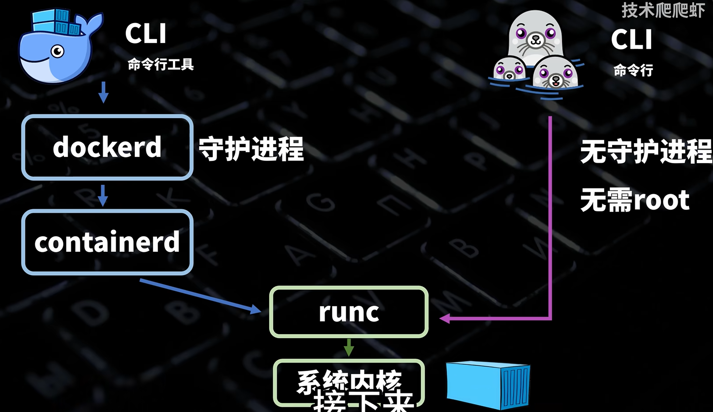

## 架构



## 安装

### Linux

```bash
sudo apt update

sudo apt install podman

ps -ef | grep podman
```

### 设置开机自启动

```bash
# 开机自动启动my-pod
podman generate systemd --name my-pod --new --files

mkdir -p ~/.config/systemd/user/

cp pod-my-pod.service container-*.service ~/.config/systemd/user/

# 重新加载
systemctl --user daemon-reload

# 生效
systemctl --user enable --now pod-my-pod.service

sudo loginctl enable-linger $(whoami)

podman pod ps
```

## 常用命令

```bash
podman ps

podman run docker.io/library/ubuntu

ip addr
```

### 配置仓库镜像站

```bash
sudo vim /etc/containers/registries.conf
[[registry]]
location = "docker.io"
    [[registry.mirror]]
    location = "docker.m.daocloud.io"

[[registry]]
location = "gcr.io"
    [[registry.mirror]]
    location = "docker.m.daocloud.io"
```

## Pod

```bash
podman pod create --name my-pod -p 8081:8081

podman pod list

mkdir /home/debian/mongo_data

podman run -d \
--pod my-pod \
--name my_mongodb \
-e MONGO_INITDB_ROOT_USERNAME=admin \
-e MONGO_INITDB_ROOT_PASSWORD=password \
-v /home/debian/mongo_data:/data/db \
docker.io/library/mongo

podman run -d \
--pod my-pod \
--name my_mongodb_express \
-e ME_CONFIG_MONGODB_SERVER=localhost \
-e ME_CONFIG_MONGODB_ADMINUSERNAME=admin \
-e ME_CONFIG_MONGODB_ADMINPASSWORD=password \
docker.io/library/mongo-express

podman ps --pod

podman pod stop my-pod

podman pod start my-pod

podman generate kube my-pod>my-pod.yaml

# 删除pod
podman pod rm -f my-pod

podman play kube my-pod.yaml
```
