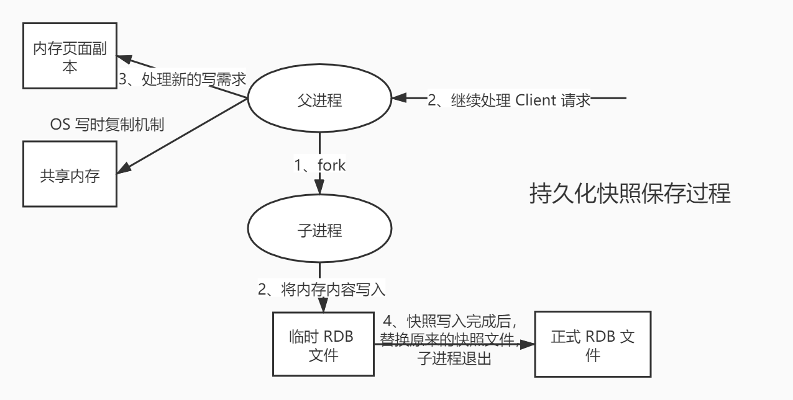

## RDB 快照存储

RDB持久化：在指定的时间间隔内，将内存中的数据集快照写入磁盘。它恢复时是将快照文件直接读取到内存中。保存快照文件为 `dump.rdb` 。

### 工作流程

redis 会单独创建（fork）一个子进程进行持久化，会先将数据写入一个临时文件中，待持久化过程结束了，再用这个临时文件替换上次持久化好的文件。整个过程中，主进程不进行任何 IO 操作，这就确保的极高的性能。如果需要大规模的数据的恢复，且对数据恢复的完整性不是非常敏感，那 RDB 方式要比 AOF 方式更加高效。RDB 唯一的缺点是最后一次持久化的数据可能会丢失。



优点：
1. 适合大规模的数据恢复
2. 对数据的完整性要求不高
3. RDB 文件在内存中的加载速度要比 AOF 快

缺点：
1. 需要一定的时间间隔进行操作，如果 redis 意外宕机，最后一次修改的数据就没有了
2. fork 进程的时候，会占用一定的内存空间

### 配置

```yaml
$ vim redis.conf

# 以下配置仅针对redis 6

#每隔 900s ，如果有超过一个 key 发生变化，就写一份新的快照
save 900 1
#每隔 300s ，如果有超过 10 个 key 发生变化，就写一份新的快照
save 300 10
#每隔 60s ，如果有超过 10000 个 key 发生变化，就写一份新的快照
save 60 10000

# 以下配置仅针对redis 7

save 3600 1 300 100 60 10000


dir ./  #rdb 文件保存的目录。修改：dir /redis7/dumpfiles
dbfilename dump.rdb  # rdb 文件的文件名。修改：dbfilename dump6379.rdb

stop-writes-on-bgsave-error yes  # 当后台保存 rdb 文件出错时，是否停止写入。默认值为 yes
rdbcompression yes  # 是否压缩 rdb 文件。默认值为 yes
rdbchecksum yes  # 是否校验 rdb 文件。默认值为 yes
rdb-del-sync-files no  # 在主从复制中，是否删除从节点的 rdb 文件。默认值为 no
```

#### 禁用快照

1. 一次生效：`redis-cli config set save ""`
2. 永久生效：修改 `redis.conf` 文件，将 `save ""` 配置项取消注释

### 触发机制

1. `save` 的规则满足的情况下，会自动触发 rdb 规则
2. 执行 `flushall` 命令，也会自动触发 rdb 规则，但是文件内容是空的，无意义
3. 退出 `redis-cli` 也会自动触发产出 rdb 文件
4. `shutdown` 停止 redis-server 也会自动触发 rdb 规则
5. 执行 `save` 手动触发 rdb 规则，生产环境禁止使用
6. 执行 `bgsave` 手动触发 rdb 规则，非阻塞保存，默认
    - 执行 `lastsave` 命令可以查看最后一次成功生成 rdb 文件的时间戳。在 linux 系统中可以使用 `date -d @1694524800` 命令将时间戳转换为日期时间格式
7. 主从复制时，主节点自动触发

### 恢复

1. 只需要将 rdb 文件放在 Redis 启动目录就可以，Redis 启动的时候会自动检查 dump.rdb ，恢复其中的数据
2. 查看存放 rdb 文件的位置，如果在这个目录下存在 dump.rdb 文件，启动就会自动恢复其中的数据

#### 修复 RDB 文件

```bash
$ cd /usr/local/bin

$ redis-check-rdb /redis7/dumpfiles/dump6379.rdb
```

## AOF 持久化

AOF 持久化：以独立日志的方式**记录每次写命令**（读操作不记录），并在 Redis 重启时重新执行 AOF 文件中的命令以达到恢复数据的目的。AOF 主要解决数据持久化的实时性、数据一致性问题（RDB 写丢失问题）。

### 工作流程

以日志形式来记录每个操作，将 Redis 执行的过程的所有指令记录下来（读操作不记录）先放入AOF缓存区保存下来，AOF缓存区会根据同步文件的三种写回策略将命令写入磁盘上的AOF文件，随着写入AOF内容的增加，会进行命令的合并（AOF重写），redis 启动之初会读取该文件重新构建数据，换言之，redis 重启的话就根据日志文件的内容将写指令从前到后执行一遍以完成数据的恢复工作。

优点：
1. 数据安全，配置 appendfsync 属性，可以选择不同的同步策略
2. 自动修复功能， redis-check-aof 工具可以解决数据一致性问题
3. 每一次修改都会同步，文件的完整性更加好

缺点：
1. AOF 文件比 RDB 文件大，且恢复速度慢
2. 数据多时，效率低于 RDB

### 配置

默认没有开启 AOF 功能。

```shell
$ vim redis.conf

dir /myredis

appendonly yes  # 是否开启 AOF 功能。默认值为 no
appenddirname "appendonlydir"  # AOF 文件的目录
appendfilename "appendonly.aof"  # AOF 文件的文件名。redis7增加到了3个文件：1.base基本文件，2.incr增量文件，3.manifest清单文件

appendfsync everysec  # 每个写操作执行完，先把日志写入到AOF文件的内存缓冲区，每隔1秒把缓冲区中的内容同步到磁盘。默认值
# appendfsync always  # 每个写命令执行完立刻同步日志到磁盘
# appendfsync no      # 每个写命令执行完先把日志写到AOF文件的内存缓冲区，由操作系统决定何时同步到磁盘
```

#### 写回策略

| 配置项      | 写回时机     | 优点           | 缺点               |
|----------|----------|--------------|------------------|
| always   | 同步写回     | 可靠性高，数据基本不丢失 | 每个写命令都要落盘，性能影响较大 |
| everysec | 每秒写回     | 性能适中         | 宕机时丢失一秒内的数据      |
| no       | 操作系统控制写回 | 性能好          | 宕机时丢失数据较多        |

#### 异常恢复

```bash
# 修复 AOF 文件
$ redis-check-aof --fix appendonly.aof.1.incr.aof
```

#### 重写机制

当AOF文件的大小超过所设定的峰值时，redis会自动启动AOF文件的内容压缩，只保留可以恢复数据的最小指令集。

可以手动使用命令 `bgrewriteaof` 来触发 AOF 重写。

```yaml
auto-aof-rewrite-percentage 100  # AOF 文件重写的触发阈值。默认值为 100%
auto-aof-rewrite-min-size 64mb  # AOF 文件重写的触发最小文件大小。默认值为 64mb

# 同时满足以上两个条件时，才会触发 AOF 重写
# 1.根据上次重写后的AOF文件大小，判断当前文件大小是不是增加了一倍
# 2.重写时满足的文件大小
```

#### 问题

1. AOF如何防止文件过大？

    AOF重写，只保留最后一次的修改记录

2. 如果每次写命令都保存，`set k1 v1 set k1 v2 set k1 v3`, 数据最终是`v3`，但是每条命令都需要存储吗？如果存储，数据恢复的时候每条命令执行，效率是不是有影响？

   AOF 有重写功能，只会保留最后一条修改的命令

## RDB + AOF 持久化

同时开启 RDB + AOF 持久化，重启时只会加载 AOF 文件进行恢复数据。

优点：
1. RDB 做全量备份
2. AOF 做增量备份

### 配置

```yaml
aof-use-rdb-preamble yes  # 开启混合持久化。默认值为 no
```

### 同时关闭 RDB 和 AOF 

```yaml
save ""  # 关闭 RDB
appendonly no  # 关闭 AOF
```
