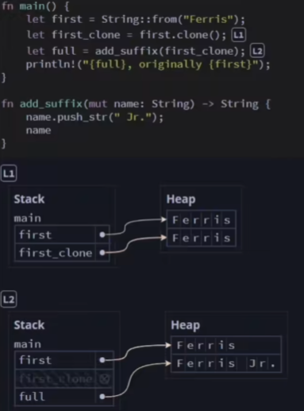

## Stack 栈内存 与 Heap 堆内存

### Stack

非常快，特点：**后进先出** 。

### Heap

无序，可存储未知大小的数据。

#### 向 Stack 与 Heap 添加变量

当函数执行完后，Stack 与 Heap 内存中的数据都会被移除。

## 所有权

### 变量存储在 Stack 中

> 按照调用的顺序，被添加到 stack 上，最新的 stack frame 总是在 stack 的顶部。当函数返回时，会自动释放该函数的 stack frame ，从而回收内存。

> Stack Frame 由 Rust 自动管理。当调用一个函数时，Rust 为被调用的函数分配一个 Stack Frame。当调用结束时，Rust 会释放该 Stack Frame 。

示例二

### Box 存放于 Heap 中

Stack

Heap

> Box 可以将数据放在 Heap 上

1. 当 a 绑定到 Box 上时，此时 a 拥有这个 Box
2. 当 b=a 时，所有权就从 a 交给了 b

#### Box 内存释放原则

- Rust 会自动释放 Box 的 heap 内存
- 如果一个变量 **拥有** 一个 Box ，当 Rust 释放该变量的 frame 时，Rust 也会释放该 Box 的 堆(heap)内存

#### 使用 Box 的集合

#### 变量在被移动后不能再使用

#### 移动堆(heap)数据原则

如果变量 x 将 heap 数据的所有权移动给另一个变量 y ，那么在移动后，x 不能再使用。

#### Clone 可避免移动

避免数据移动的一种方法是使用 .clone() 方法进行克隆。

### 存储数据

- `Stack` 按值的接收顺序来存储，按相反的顺序将它们移除 (后进先出，LIFO)
  - 添加数据叫做压入栈
  - 移除数据叫做弹出栈
- 所有存储在`Stack` 上的数据必须拥有已知的固定的大小
  - 编译时大小未知的数据或运行时大小可能发生变化的数据必须存放在`Heap` 上
- `Heap` 内存组织性差一些
  - 当把数据放入`Heap` 时，会请求一定数量的空间
  - 操作系统在`Heap` 里找到一块足够大的空间，把它标记为在用，并返回一个指针，也就是这个空间的地址
  - 这个过程叫做在`Heap` 上进行分配，有时仅仅称为“分配”
- 把值压到`Stack` 上不叫分配
- 因为指针是已知固定大小的，可以把指针存放在`Stack` 上
  - 如果想要实际数据，必须使用指针来定位
- 把数据压到`Stack` 上要比在`Heap` 上分配快得多
  - 因为操作系统不需要寻找用来存储新数据的空间，那个位置永远都在`Stack` 的顶端
- 在`Heap` 上分配空间需要做更多的工作
  - 操作系统首先需要找到一个足够大的空间来存放数据，然后要做到记录方便下次分配

### 访问数据
