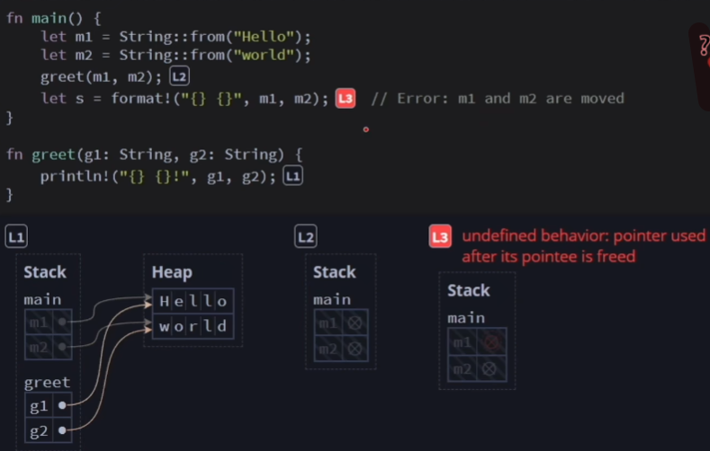
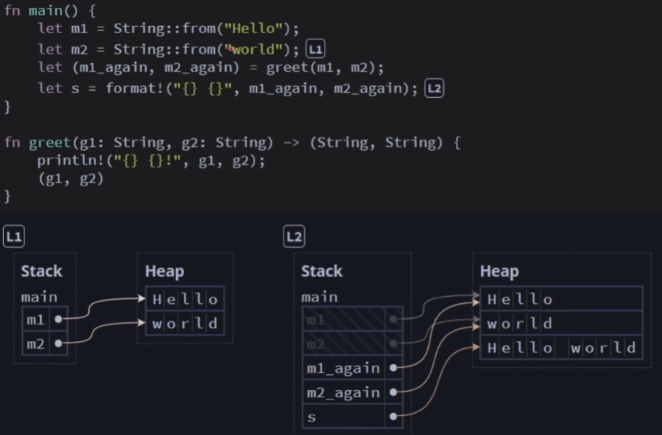
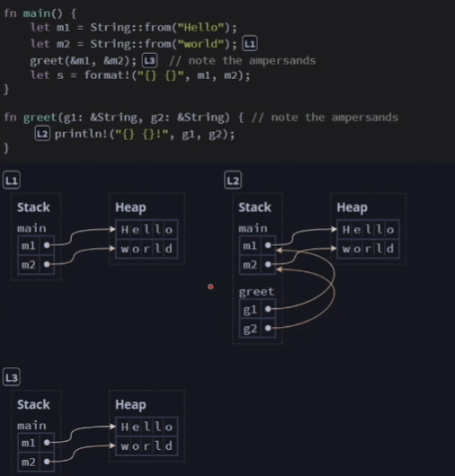
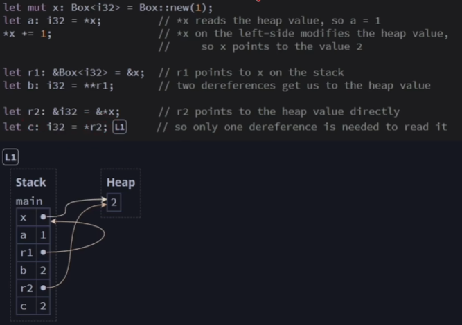
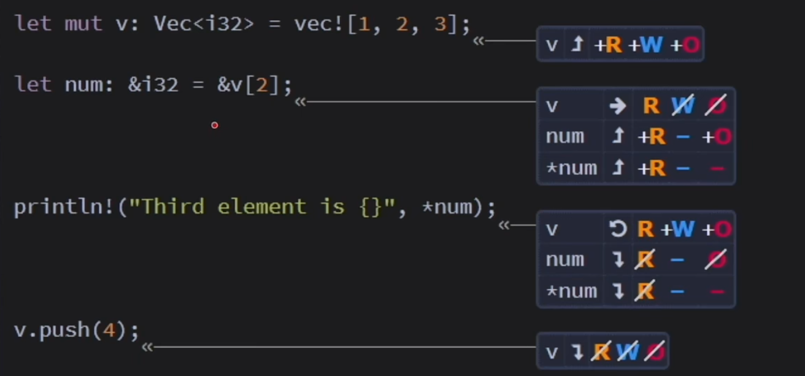

> 所有权：是确保 rust 程序安全的一种机制

> 安全：程序中没有未定义行为

规则

- 每个值都有一个变量，这个变量是该值的所有者
- 每个值同时只能有一个所有者
- 当所有者超出作用域时，该值将被删除

## Copy 和 Move

### Copy

```rust
let num1 = 32;
let mut num2 = num1;
println!("num1: {}, num2: {}",num1,num2); // num1: 32, num2: 32

num2 = 16;
println!("num1: {}, num2: {}",num1,num2); // num1: 32, num2: 16
```

### Move

```rust
let name1 = String::from("Tom");
let name2 = name1;  // 这一步是将name1的所有权移交给了name2，name1不再有效
//  println!("name1: {}",name1);  // 这一行会报错，因为name1已经不再有效
println!("name2: {}",name2);  // 这一行会输出Tom
```

示例

```rust
fn main() {
    let name1 = String::from("Tom");
    // say_hello(name1);
    // println!("name1: {}", name1);   // 这里会报错，因为name1的所有权已经被移交给了say_hello函数，所以name1已经无效了

    // fix
    say_hello(name1.clone());
    println!("name1: {}", name1);
}


fn say_hello(name: String) {
    println!("Hello, {}!", name);
}
```

## 引用和借用

错误分析



正确代码



## 引用是没有“所有权”的指针

分析



代码

```rust
fn main() {
    let m1 = String::from("world");
    println!("m1 content: {}",m1);
    println!("m1 addr: {:p}",&m1);
    greet(&m1);
    let s1 = format!("hello {}",m1);
}

fn greet(g1:&String){
    println!("{}",g1);
    let address_in_g1 = g1 as *const String;
    println!("g1: {}",g1);
    println!("g1 content: {:p}",address_in_g1);
    println!("g1 addr: {:p}",&g1);
}
```

输出

```rust
m1 content: world
m1 addr: 0x7ffc722b19b8
world
g1: world
g1 content: 0x7ffc722b19b8
g1 addr: 0x7ffc722b17b0
```

代码

```rust
fn main() {
    let m1 = Box::new("hello");
    println!("m1={}", m1); // m1=hello
    println!("m1={}", &m1); // m1=hello
}
```

## 解引用指针以访问数据

解引用运算符：\*



1. x 是一个指针，指向那个值
2. a 通过\*x 获取具体的值
3. \*x 就是 heap 内存上的那个值，可变，此刻变成 2

4. x 本身是一个指针，又对它进行一次引用，得到 r1
5. 想获取 r1 的值，需要解引用两次

6. x 是一个指针，*x 就等于 2，&*x 就相当于创建一个指针，r2 就是一个指针
7. \*r2 解引用，c 等于 2

### 隐式解引用


### 别名和可变性不可同时存在

> 别名：通过不同的变量访问同一数据

- 引用：无"所有权"的指针，旨在临时创建别名

```rust
fn main() {
    let x = Box::new(1);
    let y = x;  // 将一个Box变量赋给另一个变量：移交了所有权
    // println!("x is {}", x);  // 此处x失去了所有权，不能访问到数据
    println!("y: {}", y);  // y具有了所有权。被所有的数据只能通过它的所有者来访问

    let r1 = &y; // 多个引用可以同时访问一块数据
    let r2 = &y;
    println!("r1: {r1}, r2: {r2}");
}
```

### 引用可以临时移除 ROW 权限



代码

```rust
fn main() {
    let x = 0;
    let mut x_ref = &x;

    let y = 1;

    // *x_ref+=1;  // x本身不可变，这里会报错
    x_ref = &y;  // x_ref 重新赋值
}
```

### 可变引用

```rust
fn main() {
    let mut v:Vec<i32> = vec![1,2,3];

    let num:&mut i32 = &mut v[2];

    *num+=1;
    println!("{} ",*num);  // 4

    println!("{:?}",v);  // [1,2,4]
}
```

## 借用

借用规则：同时只能有一个可变引用或多个不可变引用

```rust
fn main() {
    let mut num = 5;
    let ref_num = &num; // 不可变引用
    let mut_num = &mut num; // 可变引用

    println!("{}, {}, {}", num, ref_num, mut_num); // 这里会报错，因为num被不可变引用，所以不能被可变引用
}
```
