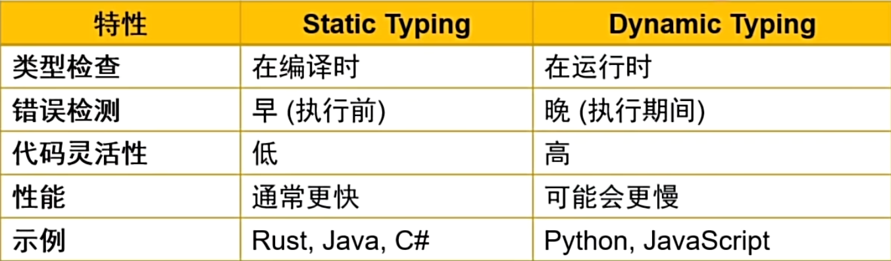
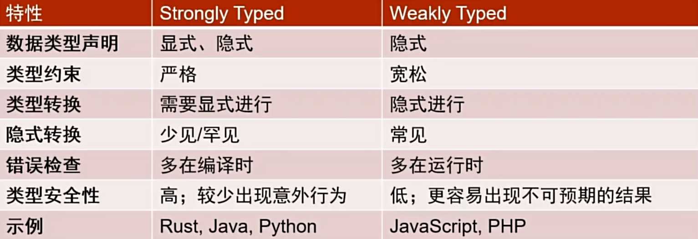
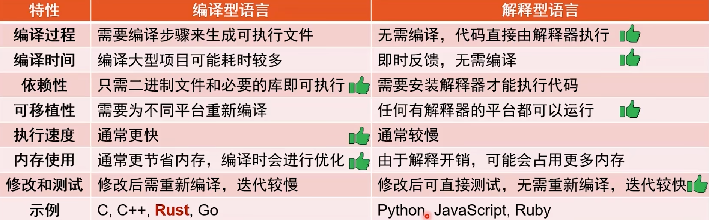

## 静态类型与动态类型 语言



Rust

```rust
fn main(){
    let x: i32 = 10; // 显式声明类型
    println!("{} ", x);
}
```

Python

```python
x = 10 # 无类型声明
print(x)

x = "hello"  # x 变成了string
```

## 强类型与弱类型



Python

```python
x = 10
y = "20"
result = x + y  # TypeError
```

JavaScript

```js
let a = 1;
let b = "2";
console.log(a + b); // "12"，发生隐式转化
```

## 编译型与解释型


